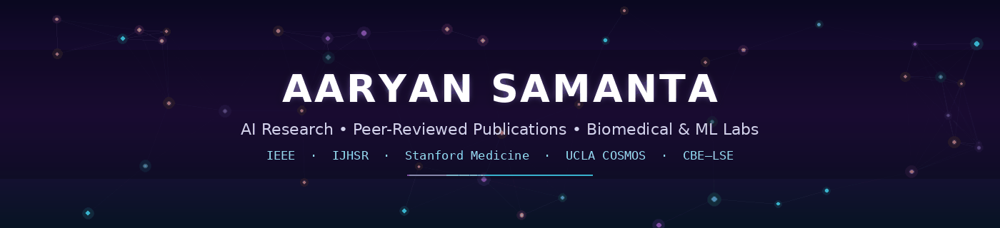

<div align="center">



<br>


<br>


<h1>🔬 AI Research & Peer-Reviewed Publications</h1>

<p>
<strong>Aaryan Samanta</strong> — 10th Grader, Legend College Preparatory, Cupertino, CA<br>
Lead author of two peer-reviewed publications (IEEE · IJHSR) as a high-school sophomore, plus three
active research programs spanning <strong>quantum-inspired ML, computational biology, biomedical
imaging, science-education research, and reinforcement learning for wildfire response.</strong>
</p>

<p>
  <a href="https://scholar.google.com/citations?user=TboJyScAAAAJ"><strong>🎓 Google Scholar</strong></a> ·
  <a href="https://aaryansamanta.com"><strong>🌐 Personal Website</strong></a> ·
  <a href="https://github.com/aaryansamanta"><strong>💻 GitHub</strong></a> ·
  <a href="https://aiethos.org"><strong>🤝 AI Ethos (501(c)(3))</strong></a>
</p>

<sub>🪄 This README is the map — every project has its own deep-dive README with figures, pipelines, and results.</sub>

</div>

---

## 🧭 Quick navigation

[🌟 Portfolio](#-research-portfolio-20252026) ·
[🏆 Highlights](#-highlights--achievements) ·
[🗂️ Repository map](#️-repository-map) ·
[🧬 Project deep dives](#-project-deep-dives) ·
[📖 Citations](#-citations) ·
[⚖️ License](#️-license--data-use)

---

## 🌟 Research Portfolio (2025–2026)

<div align="center">

| # | Project | Venue / Program | Focus | Status |
|:-:|---|---|---|:-:|
| 1 | **[Quantum-Inspired Hybrid GA + GNN Ensemble](ieee-aiam-2025-ga-gnn/)** | IEEE 7th Intl. Conf. on AI & Advanced Manufacturing (AIAM) 2025 | Quantum-inspired genetic algorithm × Graph Neural Network fusion for multimodal classification, with SHAP interpretability | ✅ **Published** |
| 2 | **[Mitochondrial Resilience in Wild *C. elegans*](ijhsr-2026-celegans-mito-resilience/)** | International Journal of High School Research (IJHSR) · UCSB SRA Capstone | Comparative genomics of six mito quality-control genes across CX11314 & EG4725 strains — selection, variant, and expression analysis | ✅ **Published** |
| 3 | **[Functional Imaging of the Pelvic Floor](stanford-urology-2026/)** | Stanford University School of Medicine (Dept. of Urology) | Kinematic ultrasound analysis (displacement → velocity → acceleration) of pelvic floor muscle function, mentored by Prof. Emeritus Christos Constantinou | 🟡 Preliminary findings |
| 4 | **[InfernoTactics — Wildfire RL Agent](ucla-cosmos-2026-c1-infernotactics/)** | UCLA COSMOS 2026, Cluster 1 | Actor-critic reinforcement learning (CNN + MLP) that dispatches firefighting resources on a real LA terrain model grounded in the Jan. 2025 Palisades Fire | ✅ Results + live 3D demo |
| 5 | **[Diagrams That Mislead: Biology Visual Literacy](cbe-diagram-misconceptions/)** | *CBE—Life Sciences Education* (ASCB) — targeted submission | Empirical study on how simplified biology diagrams create systemic student misconceptions; instruments + analysis pipeline built | 🚧 In progress |

</div>

- **< 1%** of U.S. high schoolers publish in AI/computational-biology venues — this repo holds **two** such papers from a single sophomore year.
- Spans the full stack of research skill: **wet-lab-adjacent bioinformatics → clinical imaging analysis → deep RL simulation → human-subjects education research.**

---

## 🏆 Highlights & Achievements

<table>
<tr><td width="50%" valign="top">

**📜 Publications & Research**
- 🥇 Lead author, IEEE AIAM 2025 (AIAM-6203) — quantum-inspired GA × GNN
- 🥇 Lead author, IJHSR 2026 — *C. elegans* mitochondrial genetics (DOI: 10.36838/IJHSR816.1)
- 🎓 Youngest accepted scholar, **UC Santa Barbara Summer Research Academy** (~top 10% acceptance)
- 🏥 Research Scholar, **Stanford University School of Medicine**, Dept. of Urology
- 🛰️ Selected for **UCLA COSMOS 2026**, Cluster 1 (wildfire ML/RL)

</td><td width="50%" valign="top">

**🧠 Academic & Leadership**
- 🥈🥇 **USACO 2025 US Open** — dual perfect scores (Gold *and* Silver, 1000/1000); 1 of ~8 nationwide
- 🔢 **AMC 10 & 12** — National 1st-place perfect scorer (150/150); 2× AIME qualifier
- 🌍 Founder/President, **AI Ethos, Inc.** (501(c)(3)) & **NextGenAI International** — ethical-AI education for 75+ students across 3 countries

</td></tr>
</table>

---

## 🗂️ Repository map

```
ai-research-publications/
│
├── 🖼️  banner.gif                                animated banner (this README)
├── 📄  README.md                                  ← you are here
│
├── 🧬 ieee-aiam-2025-ga-gnn/                      ✅ Published · IEEE AIAM 2025
│   ├── paper/            code/            asset/            docs/
│   └── Quantum-inspired GA + GNN ensemble for multimodal classification
│
├── 🪱 ijhsr-2026-celegans-mito-resilience/        ✅ Published · IJHSR 2026
│   ├── notebooks/        paper/           presentations/     private/
│   └── C. elegans mitochondrial resilience — variant, selection & expression analysis
│
├── 🩻 stanford-urology-2026/                      🟡 Ongoing · Stanford Medicine
│   ├── 01-phase-1-topic-and-data/    02-phase-2-imaging-analysis/    docs/
│   └── Kinematic pelvic-floor ultrasound analysis (mentored research)
│
├── 🔥 ucla-cosmos-2026-c1-infernotactics/         ✅ Results · UCLA COSMOS 2026
│   ├── infernotactics/   integration/     demo/      docs/     archive/
│   └── Actor-critic RL wildfire-response agent on real LA terrain
│
└── 📊 cbe-diagram-misconceptions/                 🚧 In progress · targeting CBE—LSE
    ├── manuscript/        instruments/       analysis/        docs/
    └── Study on simplified biology diagrams & student misconceptions
```

| Go to… | What you'll find |
|---|---|
| [`ieee-aiam-2025-ga-gnn/`](ieee-aiam-2025-ga-gnn/) | Full QIHGA-GNN implementation, paper (PDF/TeX/arXiv), SHAP figures, acceptance certificate |
| [`ijhsr-2026-celegans-mito-resilience/`](ijhsr-2026-celegans-mito-resilience/) | Annotation/variant notebook, published manuscript, SRA capstone slides, CITATION.cff |
| [`stanford-urology-2026/`](stanford-urology-2026/) | Phase 1/2 READMEs, ultrasound clip previews, research deck, data-privacy notes |
| [`ucla-cosmos-2026-c1-infernotactics/`](ucla-cosmos-2026-c1-infernotactics/) | RL package, live Cesium 3D demo, poster & write-up, honest limitations log |
| [`cbe-diagram-misconceptions/`](cbe-diagram-misconceptions/) | Study instruments, synthetic-data analysis pipeline, IRB/budget/timeline docs |

---

## 🧬 Project deep dives

### 1️⃣ Quantum-Inspired Hybrid GA + GNN Ensemble — *IEEE AIAM 2025*

<table>
<tr><td width="65%" valign="top">

First high-school-led paper hybridizing a **quantum-inspired genetic algorithm (QIHGA)** — qubit-encoded
chromosomes with quantum-rotation gates — with a **Graph Neural Network** for multimodal classification,
fused through a learned late-fusion layer and explained via **SHAP**.

| Model | Accuracy | F1 |
|---|:-:|:-:|
| **QIHGA-GNN (ours)** | **0.53** | **0.57** |
| Random Forest | 0.52 | 0.55 |
| SVM | 0.49 | 0.52 |

</td><td width="35%" valign="top">

**📌 At a glance**
- IEEE Xplore, AIAM-6203
- 📄 [Paper repo →](ieee-aiam-2025-ga-gnn/)
- 🧪 Full code + synthetic data included
- ⚖️ MIT-licensed code

</td></tr>
</table>

### 2️⃣ Natural Genetic Variation & Mitochondrial Resilience in *C. elegans* — *IJHSR 2026*

<table>
<tr><td width="65%" valign="top">

Asks why wild strains **CX11314** and **EG4725** resist mitochondrial dysfunction better than the
standard lab strain N2. Combines **CaeNDR** population variant data (540 isotypes), **Ensembl VEP**
consequence calling, dN/dS selection tests, **GEO RNA-seq** (609 samples), and a neural-net expression
predictor (Spearman **ρ = 0.959**) across six conserved mito quality-control genes
(`drp-1`, `fzo-1`, `eat-3`, `pink-1`, `pdr-1`, `atfs-1`).

</td><td width="35%" valign="top">

**📌 At a glance**
- DOI: [10.36838/IJHSR816.1](https://doi.org/10.36838/IJHSR816.1)
- 🎓 UCSB SRA 2025 Capstone (Track 5)
- 📄 [Paper repo →](ijhsr-2026-celegans-mito-resilience/)
- 🧬 Proposed CRISPR-Cas9 HDR follow-up

</td></tr>
</table>

### 3️⃣ Functional Imaging of Pelvic Floor Muscles — *Stanford Medicine*

<table>
<tr><td width="65%" valign="top">

Mentored biomedical-imaging project turning **perineal ultrasound** (5.5 MHz probe, 23 subjects) into
displacement → velocity → acceleration curves across three physiological states: voluntary contraction
("The Knack"), Valsalva, and cough. Preliminary finding: **voluntary contraction increases urethral
support**, with **no significant caudal displacement on cough**.

</td><td width="35%" valign="top">

**📌 At a glance**
- 🧑‍⚕️ Mentor: Dr. Christos E. Constantinou (Prof. Emeritus, Stanford Urology)
- 🟡 Status: preliminary, not yet published
- 📄 [Project repo →](stanford-urology-2026/)
- 🔒 Clinical data — no license granted, all rights reserved

</td></tr>
</table>

### 4️⃣ InfernoTactics — Fire-Relative RL for Wildfire Response — *UCLA COSMOS 2026*

<table>
<tr><td width="65%" valign="top">

An actor-critic agent (CNN over a 595×316 terrain grid + MLP over weather/fleet scalars) that dispatches
firefighting resources using a **fire-relative action space** — so it generalizes to ignition points it
never trained on. Grounded in real SRTM elevation, OSM buildings/roads, NOAA weather, and the **January
2025 Palisades Fire**. Over training, mean reward improved **52%** and buildings lost fell **54%**.

</td><td width="35%" valign="top">

**📌 At a glance**
- 🖥️ Live Cesium 3D demo + FastAPI backend
- 🎬 No-server replay viewer included
- 📄 [Project repo →](ucla-cosmos-2026-c1-infernotactics/)
- ⚠️ Honest limitations documented (synthetic traffic, unsourced constants)

</td></tr>
</table>

### 5️⃣ When Help Becomes a Hindrance — Biology Diagram Misconceptions — *targeting CBE—LSE*

<table>
<tr><td width="65%" valign="top">

Examines how **simplified biology diagrams** (static snapshots, single-arrow flows, no variation shown)
plant systemic misconceptions in students — and tests **redesigned, clarification-enhanced** versions
against them across a 3-phase study (deconstruct → empirical test → synthesize design guidelines).

</td><td width="35%" valign="top">

**📌 At a glance**
- 🧪 Instruments + IRB/consent docs drafted
- 📊 Stats pipeline built & validated on synthetic data
- 📄 [Project repo →](cbe-diagram-misconceptions/)
- 🚧 Status: pre-data-collection

</td></tr>
</table>

---

## 📖 Citations

```bibtex
@inproceedings{samanta2025qihga,
  author    = {Samanta, Aaryan},
  title     = {Quantum-Inspired Hybrid Genetic Algorithm and Graph Neural Network
               Ensemble for Multimodal Classification},
  booktitle = {2025 7th International Conference on Artificial Intelligence and
               Advanced Manufacturing (AIAM)},
  year      = {2025},
  publisher = {IEEE}
}

@article{samanta2026celegans,
  author  = {Samanta, Aaryan and Mandal, Mansi and Meeran, Mohammed Yasar},
  title   = {Natural Genetic Variation in Mitochondrial Health-Regulating Genes in the
             C. elegans Strains CX11314 and EG4725 Leads to Increased Mitochondrial Resilience},
  journal = {International Journal of High School Research},
  year    = {2026},
  doi     = {10.36838/IJHSR816.1}
}
```

Each publication folder also ships its own `CITATION.cff` / full `.bib` file for direct reuse.

---

## ⚖️ License & data use

- Code within `ieee-aiam-2025-ga-gnn/` and `ijhsr-2026-celegans-mito-resilience/` is released under **MIT** — see each project's `LICENSE`.
- Published articles are © their respective venues (IEEE / Terra Science and Education) and are **not** covered by the MIT license.
- `stanford-urology-2026/` contains **mentor-owned clinical data**; no license is granted — see [`docs/data-and-privacy.md`](stanford-urology-2026/docs/data-and-privacy.md).
- `cbe-diagram-misconceptions/` license is **TBD** pending public release.
- `ucla-cosmos-2026-c1-infernotactics/` third-party terrain/GLB assets retain their original licenses.

---

<div align="center">

### 🙏 Acknowledgments

UC Santa Barbara Summer Research Academies · Stanford University School of Medicine (Dr. Christos E. Constantinou) · UCLA COSMOS Program · IEEE AIAM 2025 Committee · IJHSR Editorial Board · CaeNDR · Ensembl · WormBase · NCBI GEO

<br>

<sub>Made with 🔬 curiosity, 🧬 late nights, and way too much coffee-adjacent tea · Updated 2026</sub>

</div>
