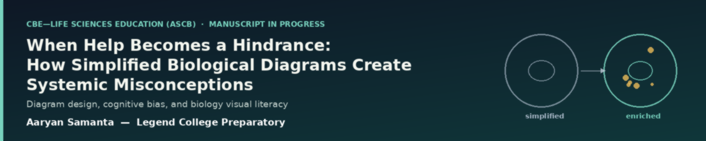

<p align="center">
  
</p>

# When Help Becomes a Hindrance: How Simplified Biological Diagrams Create Systemic Misconceptions

**Status:** 🚧 Manuscript in progress — targeting submission to *CBE—Life Sciences Education* (ASCB)

**Author:** Aaryan Samanta — Legend College Preparatory, Cupertino, CA

## Abstract

Simplified biological diagrams are common in educational contexts, helping students grapple with complex biological systems presented in digestible visuals — but do these simplifications come at a cost, activating biases and misinterpretations of the very processes they're meant to explain? This project examines how simplified biology diagrams do (and don't) shape students' mental models and create systemic misconceptions, and explores the mechanisms by which visuals both help and hinder understanding (e.g., dynamic processes diagrammed statically, linearly, or overly "cleanly").

The study design pairs standard simplified diagrams against redesigned, clarification-enhanced versions, using isolated interventions with tightly controlled post-measures of student understanding and retention. Planned deliverables:

1. A **Misconception–Diagram Feature map** for 2–3 high-impact biology topics
2. A set of classroom-ready **"standard vs. redesigned" diagram pairs**
3. **Evidence-based guidelines** and short visual-literacy prompts for teachers/illustrators

Success is evaluated via a reduced rate of misconceptions on direct measures and conceptual transfer on a post-test and drawing task.

**Keywords:** biology diagrams · visual literacy · misconceptions · conceptual change · science education · cognitive load

## Repository Structure

```
cbe-diagram-misconceptions/
├── README.md.txt              # This file (rename to README.md on GitHub)
├── banner.png                 # Repo banner
├── manuscript/                # Current draft(s) of the paper/proposal
│   ├── CBE_Paper_Draft.docx
│   └── CBE_Paper_Draft.pdf
├── asset/                     # Figures used in the manuscript
│   ├── Figure 1 Research Framework (3-Phase Overview).png
│   ├── Figure 2 Simplified vs Enriched Cell Diagram.png
│   ├── Figure 3 Study Design Flowchart.png
│   ├── Figure 4 How to Read Biology Diagrams.png
│   └── Figure 5 Diagram Feature to Misconception Map.png
├── instruments/                # Draft instruments (Phase 1 & 2)
│   ├── misconception_survey.md      # Phase 1 survey — cell structure, central dogma, life cycles
│   ├── pre_post_assessment.md       # Phase 2 pre/post factual + misconception-probing items
│   └── drawing_task.md              # Draw-to-explain task + scoring rubric
├── data/
│   └── synthetic/               # FAKE placeholder data for testing the analysis pipeline only
│       ├── README.md
│       ├── generate_synthetic_data.py
│       └── synthetic_pilot_data.csv
├── analysis/                   # Stats pipeline (chi-square, t-test/Mann-Whitney, Cohen's d)
│   ├── analysis_plan.md
│   ├── analyze_pilot.py
│   └── requirements.txt
└── docs/                        # Logistics
    ├── timeline.md
    ├── budget.md
    ├── consent_assent_template.md
    └── irb_checklist.md
```

> On GitHub, rename `README.md.txt` → `README.md` so it renders as the repo landing page.

## Project Overview

### Motivation

Instructional figures that encode incorrect details or emphasize wrong proportions get adopted "as is" by students — the classic example being the belief that deoxygenated blood is blue because textbook diagrams color veins blue. Diagram symbols and mappings (arrows, cycles, layouts) are especially prone to literal misreading: students may see a linear life-cycle diagram and assume species spend equal time in each stage, or read a central dogma arrow as "DNA becomes RNA" rather than transcription. These early misconceptions persist and become barriers to learning advanced topics. Very few empirical studies have isolated specific design factors (arrow styles, missing variability, missing scale cues) and quantified how they drive misconception frequency and transfer — that's the gap this project targets.

### Approach — Three Phases

| Phase | Focus | Key Activities |
|---|---|---|
| 1. Deconstruct Diagrams | Identify diagram types & code simplification strategies | Literature scan, misconception survey (high school biology students), predicted misconception pathways |
| 2. Empirical Testing | Controlled comparison of standard vs. redesigned diagrams | Recruit students, assign simplified vs. enriched conditions, interpretation + concept + drawing-to-explain tasks |
| 3. Analyze & Synthesize | Quantify effect, extract generalizable design principles | Quantitative comparisons (chi-square, t-test/non-parametric), qualitative coding of drawings/explanations, output design guidelines |

### Diagram Feature → Misconception Map (examples)

| Diagram Feature | Cognitive Bias Heuristic | Resulting Misconception |
|---|---|---|
| Static snapshot | Systems seen as fixed | Cells are static parts, not interacting processes |
| Single-arrow linear flow | One-way causality | Biological cycles are linear |
| No variation shown | Essentialism | All offspring are identical / all survive |
| Ambiguous arrows | Spread symbol convention | Wrong interpretation of process direction or causality |

### Resources & Budget

| Item | Quantity | Est. Cost (USD) | Purpose |
|---|---|---|---|
| Printing and handouts | 300 pages | $120 | Surveys and instructional materials |
| Participant incentives | 120 students | $360 | Encourage participation |
| Graphic design software/tools | 1 license | $120 | Diagram redesign |
| Data analysis & transcription | — | $100 | Coding and analysis |
| Miscellaneous/contingency | — | $100 | Unforeseen expenses |
| **Total** | | **$800** | |

### Timeline

- **Months 1–2:** Literature review, diagram selection, ethics preparation
- **Month 3:** Pilot testing of surveys and instruments
- **Months 4–6:** Main data collection (high school and college cohorts)
- **Months 6–7:** Quantitative and qualitative analysis
- **Months 8–9:** Diagram refinement and follow-up testing
- **Month 10:** Synthesis of findings and final report / manuscript preparation

## Selected References

Full reference list is in the manuscript. Key sources include:

- Arneson & Offerdahl (2018), *CBE—Life Sciences Education* — visual literacy and Bloom's taxonomy
- Coley & Tanner (2015), *CBE—Life Sciences Education* — intuitive biological thinking and misconceptions
- Menendez, Rosengren, & Alibali (2022), *Applied Cognitive Psychology* — perceptual richness in learning biological change
- Uminski, Newman, & Wright (2025), *CBE—Life Sciences Education* — visual literacy and chromosome misconceptions
- Wright, Cardenas, Liang, & Newman (2018), *CBE—Life Sciences Education* — arrows in biology diagrams

## Status / Next Steps

- [x] Draft Phase 1 misconception survey (`instruments/misconception_survey.md`)
- [x] Draft Phase 2 pre/post assessment + drawing task (`instruments/`)
- [x] Build analysis pipeline against synthetic placeholder data (`analysis/`, `data/synthetic/`)
- [x] Draft consent/assent templates + IRB checklist (`docs/`)
- [ ] Finalize 2–3 target diagram types from literature scan + pilot the survey with real students
- [ ] Get school administration + mentor/IRB sign-off (see `docs/irb_checklist.md`)
- [ ] Draft redesigned diagram pairs (standard vs. enriched) for the finalized topics
- [ ] Run controlled comparison study; replace synthetic data with real data
- [ ] Analyze real results and draft final manuscript for CBE—Life Sciences Education submission

## Running the Analysis Pipeline

```bash
pip install -r analysis/requirements.txt
cd data/synthetic && python3 generate_synthetic_data.py   # regenerate placeholder data if needed
cd ../../analysis && python3 analyze_pilot.py               # runs chi-square + t-test/Mann-Whitney per topic
```

Swap in the real dataset (same column structure as `data/synthetic/synthetic_pilot_data.csv`) once Phase 2/3 data collection is complete: `python3 analyze_pilot.py path/to/real_data.csv`.

## License

TBD — add a license before making the repository public if you plan to share code/instruments openly.
