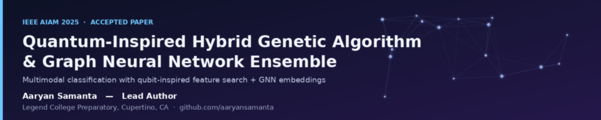

<div align="center">

  

  <br><br>

  
  
  
  

  <h1>Quantum-Inspired Hybrid Genetic Algorithm<br>& Graph Neural Network Ensemble<br>for Multimodal Classification</h1>

  <p><strong>Lead Author:</strong> Aaryan Samanta • Legend College Preparatory, Cupertino, CA</p>
  <p><strong>Corresponding author:</strong> aaryan.samanta@gmail.com</p>

  <p>
    <a href="https://ieeexplore.ieee.org/abstract/document/11322272"><strong>📄 IEEE Xplore Paper</strong></a>
     • 
    <a href="https://github.com/aaryansamanta/ai-publications/blob/main/ieee-aiam-2025-ga-gnn/docs/acceptance_certificate.pdf"><strong>Acceptance Certificate</strong></a>
     • 
    <a href="https://github.com/aaryansamanta/ai-publications/blob/main/ieee-aiam-2025-ga-gnn/docs/ieee_copyright.pdf"><strong>IEEE Copyright</strong></a>
  </p>

</div>

---

## 🌟 What Makes This Work Special

- First high-school-led paper to hybridize **quantum-inspired genetic algorithms** with **Graph Neural Networks** for multimodal classification
- Novel qubit-based feature selection + GNN relational learning + learned late fusion
- Interpretable via SHAP + surrogate fitness for fast evolutionary search
- Accepted & published in **IEEE AIAM 2025** (AIAM-6203)

## Abstract

High-dimensional, heterogeneous datasets are hard to classify well because of complex feature interactions and mixed data structures. This work proposes **QIHGA** — a quantum-inspired hybrid genetic algorithm — combined with a **graph neural network (GNN)** inside a multimodal ensemble framework.

- **QIHGA** uses qubit-based representation and superposition-style mechanisms to search feature/parameter spaces more effectively than classical genetic algorithms, improving feature selection and model tuning.
- The **GNN module** builds graph representations of the data to capture relationships among features or samples, learning structured embeddings that traditional models miss.
- A **fusion layer** combines the optimized feature subsets with the GNN embeddings to produce the final classification output.

Experiments show the hybrid model outperforms standard machine learning classifiers on accuracy and robustness, while remaining interpretable — feature selection highlights influential variables and the graph structure reveals relational importance.

**Keywords:** Quantum-inspired optimization · Graph neural networks · Multimodal data fusion · Evolutionary algorithms · Ensemble learning · Classification

## 📊 Key Results (Test Set)

| Model                  | Accuracy | Precision | Recall | F1    |
|------------------------|----------|-----------|--------|-------|
| **QIHGA-GNN (Ours)**   | **0.53** | **0.51**  | **0.64**| **0.57** |
| Random Forest          | 0.52     | 0.56      | 0.54   | 0.55  |
| SVM                    | 0.49     | 0.50      | 0.52   | 0.52  |
| Logistic Regression    | 0.34     | 0.48      | 0.44   | 0.47  |

Modest but consistent gains over strong baselines on synthetic multimodal biomedical data.

## 🚀 Core Innovations

1. **QIHGA** – Qubit-encoded chromosomes + quantum rotation gates for superior exploration in high-dimensional feature spaces
2. **Per-modality GNN encoders** – Sample graphs + feature graphs with GCN/GAT
3. **Learned late fusion** – Convex combination with simplex weights
4. **SHAP interpretability** + surrogate fitness for 10× faster evolution

## Repository Structure

```
ieee-aiam-2025-ga-gnn/
├── README.md.txt              # This file (rename to README.md on GitHub)
├── banner.png                 # Repo banner
├── paper/                     # Publication + proof of acceptance
│   ├── paper.tex
│   ├── paper.md
│   ├── paper.bib
│   ├── paper.pdf              # Official AIAM version
│   ├── arXIV.pdf              # arXiv version
│   ├── paper.docx
│   ├── paper_ieee_copyright.pdf
│   ├── paper_reference.pdf
│   └── acceptance_certificate.pdf
├── code/                      # Full implementation (QIHGA + GNN + fusion)
│   ├── aiaam-core code.py     # QIHGA + GNN ensemble, metrics, SHAP plots
│   ├── aiam-code.xlsx
│   └── requirements.txt
├── data/                      # Synthetic dataset used for experiments
│   └── aiam-data.xlsx
├── asset/                     # Figures referenced in the paper
│   ├── Figure 1  Research framework..png
│   ├── Figure 2 Performance Comparison.png
│   ├── Figure 3 SHAP Summary Plot.png
│   ├── Figure 4 SHAP Dependence Plot.png
│   └── Figure 5 Sensitivity Analysis.png
└── docs/                      # Acceptance certificate + IEEE copyright transfer
    ├── **Important** IEEE AIAM Acceptance Certificate
    └── **Important** IEEE AIAM Paper.pdf
```

> On GitHub, rename `README.md.txt` → `README.md` so it renders as the repo landing page.

## Figures

| | |
|---|---|
|  **Fig. 1** — Research framework |  **Fig. 2** — Performance comparison |
|  **Fig. 3** — SHAP summary plot |  **Fig. 4** — SHAP dependence plot |
|  **Fig. 5** — Sensitivity analysis | |

## Getting Started

### Requirements

```
numpy
pandas
matplotlib
seaborn
shap
scikit-learn
xgboost
```

Install with:

```bash
pip install -r code/requirements.txt
```

### Running the code

The core script (`code/aiaam-core code.py`) trains a classifier on `data/aiam-data.xlsx`, computes accuracy/precision/recall/F1, and generates the SHAP and sensitivity figures used in the paper.

```bash
python "code/aiaam-core code.py"
```

> Note: the script currently reads its input path from a local `Desktop` folder — update `data_path` at the top of the script to point at `data/aiam-data.xlsx` before running it from a fresh clone.

## 📖 Citation

```bibtex
@inproceedings{samanta2025qihga,
  title     = {Quantum-Inspired Hybrid Genetic Algorithm and Graph Neural Network Ensemble for Multimodal Classification},
  author    = {Samanta, Aaryan},
  booktitle = {2025 7th International Conference on Artificial Intelligence and Advanced Manufacturing (AIAM)},
  year      = {2025},
  publisher = {IEEE}
}
```

(See `paper/paper.bib` for the full reference file.)

## License

This project is released under the [MIT License](LICENSE).
