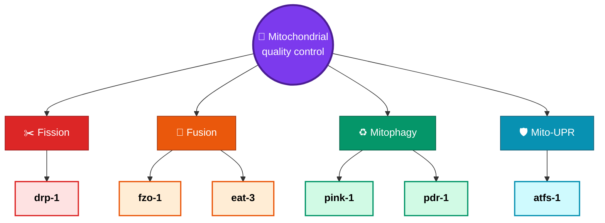
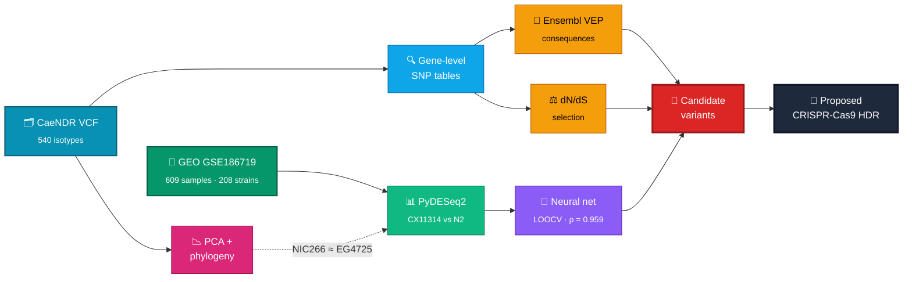

<div align="center">

# 🧬 Natural Genetic Variation in Mitochondrial Health-Regulating Genes

### *…in the* C. elegans *strains* **CX11314** *and* **EG4725** *leads to increased mitochondrial resilience*

<br>

[](https://doi.org/10.36838/IJHSR816.1)
[](https://ijhighschoolresearch.org)

[](LICENSE)


<br>

**Aaryan Samanta · Mansi Mandal · Mohammed Yasar Meeran**

<sub>Begun in the UC Santa Barbara Summer Research Academies (SRA) 2025 — *Track 5: Molecular Clock*</sub>

</div>

---

## 🔬 The question

> Most *C. elegans* work uses the lab strain **N2 (Bristol)**.
> **Which natural genetic variants let the wild strains CX11314 and EG4725 resist mitochondrial
> dysfunction and heteroplasmy?**

Mitochondrial dysfunction accumulates with age, and roughly **1 in 5,000 people** carries a genetic
mitochondrial disease. This study looks for the answer not in induced lab mutations, but in the
variation wild worms already carry.

### 🧩 Six conserved quality-control genes



---

## 🧪 The pipeline



> [!NOTE]
> **Why NIC266?** EG4725 is absent from GSE186719. PCA across 540 isotypes identified **NIC266 as the
> closest strain to EG4725**, with very few SNP differences between them — so NIC266 stands in as a
> proxy for the differential-expression work.

---

## 📈 Key findings

### ⚖️ Selection: three genes constrained, three drifting

<div align="center">

| Gene | Pathway | dN/dS | Interpretation |
|:--|:--|:--:|:--|
| **`drp-1`** | ✂️ Fission | 🟢 `< 1` | Purifying selection — changes often deleterious |
| **`pdr-1`** | ♻️ Mitophagy | 🟢 `< 1` | Purifying selection |
| **`atfs-1`** | 🛡️ Mito-UPR | 🟢 `< 1` | Purifying selection |
| **`pink-1`** | ♻️ Mitophagy | 🟡 `= 1` | Evolving neutrally |
| **`eat-3`** | 🔗 Fusion | 🟡 `= 1` | Evolving neutrally |
| **`fzo-1`** | 🔗 Fusion | 🟡 `= 1` | Evolving neutrally |

</div>

### 🧾 Variant consequences (VEP, CX11314 + EG4725)

| Gene | 🔵 Synonymous | 🟠 Missense | 🔴 Stop-gained | Notable |
|:--|--:|--:|--:|:--|
| **`drp-1`** | `75%` | — | — | Most conserved; 12 missense variants, mostly conservative |
| **`pink-1`** | `59%` | `41%` | — | Glu→Lys, Asn→Asp, Ala→Ser, Pro→Ser |
| **`fzo-1`** | `56%` | `44%` | — | Pro→Ser, Ala→Thr, Arg→Gln alter polarity/charge |
| **`pdr-1`** | `53%` | `43%` | ⚠️ `3%` | Only gene with stop-gained → possible truncated protein |
| **`atfs-1`** | `53%` | `45%` | — | **Most missense variants (34)**; 7× Gln→Arg |
| **`eat-3`** | `52%` | `48%` | — | 5 substitutions; Thr→Ala flips polarity |

### 📊 Expression

<table>
<tr><td width="50%" valign="top">

**Observed (TPM, GSE186719)**
- 🥇 `eat-3` — highest overall expression
- 📈 `pdr-1` — elevated in **CX11314**
- 📉 `fzo-1`, `pink-1` — low across strains

</td><td width="50%" valign="top">

**Predicted for EG4725 (neural net)**
- Trained on **204 strains**, LOOCV
- Spearman **ρ = 0.959**
- Higher `pdr-1` **and** `atfs-1`

</td></tr>
</table>

> [!IMPORTANT]
> Most transcripts did **not** reach the BH-adjusted `p < 0.05` threshold. The claim is that PCA
> clustering, phylogenetic divergence, VEP results and expression shifts **together** point toward
> fine-tuned mitochondrial regulation — not that any single comparison is individually significant.

### 🧬 Proposed follow-up

CRISPR-Cas9 **homology-directed repair** swapping both promoter and coding regions of **`pdr-1`** and
**`atfs-1`** from EG4725 into N2, across four groups:

<div align="center">

`N2 (control)` ➜ `N2 + EG4725 pdr-1` ➜ `N2 + EG4725 atfs-1` ➜ `EG4725 (baseline)`

</div>

📄 Full results, figures and limitations: **[`paper/manuscript_ijhsr_final.pdf`](paper/manuscript_ijhsr_final.pdf)**

---

## 📁 Repository structure

```
🧬 ijhsr-2026-celegans-mito-resilience/
│
├── 📓 notebooks/
│   └── 01_gene_annotation_blast_snp_vep.ipynb   GTF/FASTA parsing · BLAST · SNP extraction · VEP
│
├── 📄 paper/
│   ├── manuscript_ijhsr_final.pdf               ⭐ published IJHSR version
│   ├── manuscript_draft_2025-11.(docx|pdf)      earlier draft
│   └── graphical_abstract.pdf
│
├── 🎤 presentations/
│   └── resetting-the-clocks_sra-capstone-2025.(pptx|pdf)   SRA Capstone Seminar · Jul 24 2025
│
├── 📚 docs/                                     seminar program
├── 💾 data/                                     not tracked — see data/README.md
├── 🔒 private/                                  git-ignored; local-only personal documents
├── 📦 requirements.txt
├── 📌 CITATION.cff
└── ⚖️  LICENSE
```

---

## 🚀 Getting started

```bash
git clone https://github.com/<your-username>/ijhsr-2026-celegans-mito-resilience.git
cd ijhsr-2026-celegans-mito-resilience

python -m venv .venv && source .venv/bin/activate
pip install -r requirements.txt

jupyter lab notebooks/
```

Then download the reference genome, annotation, VCF, and expression data listed in
**[`data/README.md`](data/README.md)**.

> [!WARNING]
> The notebook was written in **Google Colab** and mounts Google Drive
> (`/content/drive/MyDrive/SRA2025_Reference_dataset/...`).
> To run locally: skip the Drive-mount cells and repoint the file paths to `data/`.

<details>
<summary><b>📥 Required data files</b></summary>

<br>

| File | Used for | Source |
|---|---|---|
| `Caenorhabditis_elegans.WBcel235.dna.toplevel.fa` | Reference genome (WBcel235, GCA_000002985.3) | [Ensembl](https://useast.ensembl.org/Caenorhabditis_elegans/Info/Index) |
| `Caenorhabditis_elegans.WBcel235.114.gtf` | Gene annotation (Ensembl release 114) | [Ensembl](https://useast.ensembl.org/Caenorhabditis_elegans/Info/Index) |
| `selected_isolates_WI.20210121.hard-filter.isotype.vcf.gz` | Natural-variation SNPs | [CaeNDR](https://caendr.org/) release 20210121 |
| GEO **GSE186719** | RNA-seq counts + TPM, 609 samples / 208 strains | [NCBI GEO](https://www.ncbi.nlm.nih.gov/geo/query/acc.cgi?acc=GSE186719) |

</details>

<details>
<summary><b>🧰 Software stack reported in the manuscript</b></summary>

<br>

| Tool | Version | Role |
|---|---|---|
| Biopython | `1.85` | ✅ sequence handling *(in `requirements.txt`)* |
| pandas | — | ✅ dataframes *(in `requirements.txt`)* |
| scikit-allel | `1.3.13` | 🔜 VCF / variant arrays |
| ETE3 | `3.1.3` | 🔜 phylogenetic tree |
| PyDESeq2 | `1.40.2` | 🔜 differential expression |
| NumPy · SciPy · Matplotlib | `2.3.2` · `1.16.0` · `3.10.8` | 🔜 numerics + figures |
| Keras · TensorFlow · scikit-learn | `3.10.0` · `2.19.0` | 🔜 EG4725 expression prediction |

🔜 = commented out in `requirements.txt` until the matching notebook lands.

</details>

---

## 🗺️ Scope & roadmap

> [!CAUTION]
> **The notebook in this repo covers only the annotation + variant workflow** — GTF parsing, FASTA
> extraction, BLAST (paralogs and human orthologs), CaeNDR SNP summaries for CX11314/EG4725, and
> VCF prep for VEP. The PCA, phylogeny, dN/dS, PyDESeq2, and neural-network analyses **reported in
> the paper are not yet included here.**

| | Planned addition |
|:--:|---|
| ☐ | PCA and phylogeny notebook (540 isotypes; 12-isotype tree) |
| ☐ | dN/dS selection notebook |
| ☐ | PyDESeq2 differential-expression notebook (volcano + box plots) |
| ☐ | EG4725 expression-prediction notebook (Keras, LOOCV) |
| ☐ | Replace Colab/Drive paths with a config file |
| ☐ | Export figures to `figures/` |

---

## 📌 Citation

```bibtex
@article{samanta2026celegans,
  title   = {Natural Genetic Variation in Mitochondrial Health-Regulating Genes in the
             C. elegans Strains CX11314 and EG4725 Leads to Increased Mitochondrial Resilience},
  author  = {Samanta, Aaryan and Mandal, Mansi and Meeran, Mohammed Yasar},
  journal = {International Journal of High School Research},
  year    = {2026},
  doi     = {10.36838/IJHSR816.1}
}
```

GitHub's **"Cite this repository"** button reads [`CITATION.cff`](CITATION.cff).

---

## 🙏 Acknowledgments

- **UC Santa Barbara Summer Research Academies**, Track 5 (Molecular Clock)
- The **Rothman Laboratory at UCSB** — unpublished protein-abundance data shown in the manuscript
- Samantha Fiallo, Max Frank, and Ryan (Dongmin) Son for guidance; workshop notebook template credit to Ryan Son
- Data resources: [CaeNDR](https://caendr.org/) · [Ensembl](https://www.ensembl.org/) · [WormBase](https://wormbase.org/) · [NCBI GEO](https://www.ncbi.nlm.nih.gov/geo/query/acc.cgi?acc=GSE186719)

---

## ⚖️ License

Code is released under the **[MIT License](LICENSE)**.
The published article in `paper/` is **© 2026 Terra Science and Education** and is *not* covered by the MIT license.

<div align="center">
<br>
<sub>🪱 <b>Wild worms, not lab mutants.</b> 🪱</sub>
</div>
