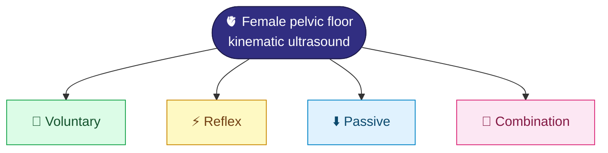

# 🧭 Phase 1 · Topic & Data

**December 2025 – March 2026**

[⬅️ Back to project home](../README.md) · [➡️ Phase 2](../02-phase-2-imaging-analysis/)

---

## 🎯 What Phase 1 set out to do

Phase 1 fixed **who** would guide the work, **what** the research question would be, and **which data** would be used.

| | |
|---|---|
| 🎓 **Mentor** | [Dr. Christos E. Constantinou](https://med.stanford.edu/profiles/christos-constantinou), Professor Emeritus, Stanford Surgery (Urology) & Human Biology, working in biomedical imaging |
| 🧬 **Topic** | Ultrasound imaging data from controls and patients (anonymized), covering kinematic imaging of the female pelvic floor |
| 🎛️ **Conditions** | Four stimulation states: voluntary, reflex, passive and combination |
| 🧊 **Stated goal** | Use the data to generate a **3D numerical model** |
| 📦 **Data source** | Individual subject records plus summarized data from the mentor's publications and reports |

## 🎛️ The four stimulation states

In the Phase 2 deck these appear as the **voluntary** contraction ("The Knack"), **passive** Valsalva, and the **transient**, reflexive cough. See [Phase 2](../02-phase-2-imaging-analysis/).

## 📎 Artifacts

### 📄 Reading (`reading/`)

| File | About |
|---|---|
| [`BJU International - 2002 - Constantinou - Determining the displacement of the pelvic floor and pelvic organs during.pdf`](reading/BJU%20International%20-%202002%20-%20Constantinou%20-%20Determining%20the%20displacement%20of%20the%20pelvic%20floor%20and%20pelvic%20organs%20during.pdf) | Constantinou et al., *BJU Int* 2002. Pelvic floor and pelvic organ displacement during voluntary contraction, measured with MRI in younger and older women. |

*Also shared by the mentor, to be added: `ConstantinouChapter.pdf` and `VAGbiomech.pdf`.*

### 🎬 Media (`media/`)

| File | About |
|---|---|
| [`pelvic_floor (Converted).mov`](media/pelvic_floor%20%28Converted%29.mov) | 3D anatomy animation of the pelvic floor (carries a third-party PRIMAL logo) |
| [`pfm_without_cross Converted (Converted).mov`](media/pfm_without_cross%20Converted%20%28Converted%29.mov) | Annotated ultrasound clip of the voluntary pelvic floor maneuver. This is the same recording as [`pfm-maneuver-knack.mp4`](../02-phase-2-imaging-analysis/media/ultrasound/pfm-maneuver-knack.mp4) in Phase 2. |

Full citations for this reading, plus general background on scientific diagrams, are in [`docs/references.md`](../docs/references.md).

> [!NOTE]
> The PDF and the animation are third-party material. See [Data & privacy](../docs/data-and-privacy.md) before making the repository public.

## 🧊 About the 3D numerical model

The 3D numerical model was the stated **Phase 1 goal**. It is **not** part of the Phase 2 module scope, and whether it is still expected is to be confirmed with the mentor. Nothing in this repository claims that such a model has been built.

## 🔒 Where the data live

The original subject records stay with the mentor and are **not** in this repository. See [Data & privacy](../docs/data-and-privacy.md).

---

The analysis, figures and presentation live in [Phase 2](../02-phase-2-imaging-analysis/).
