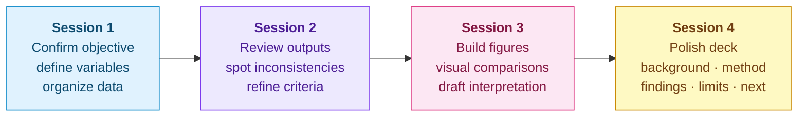
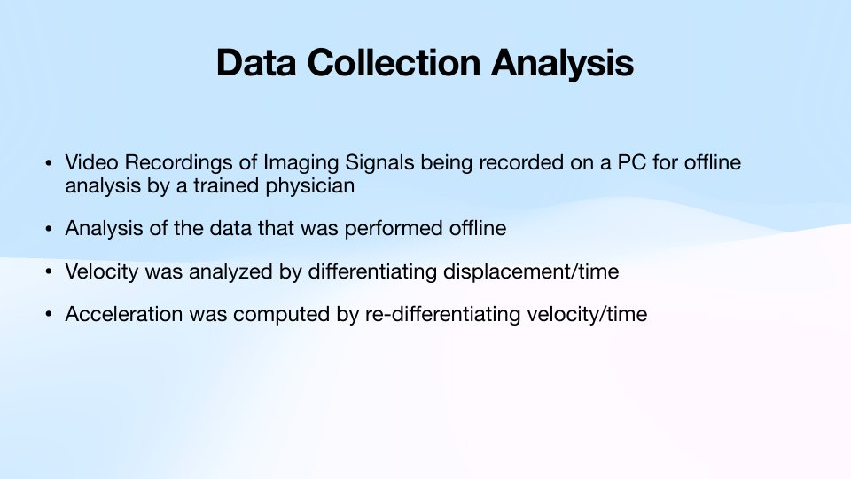
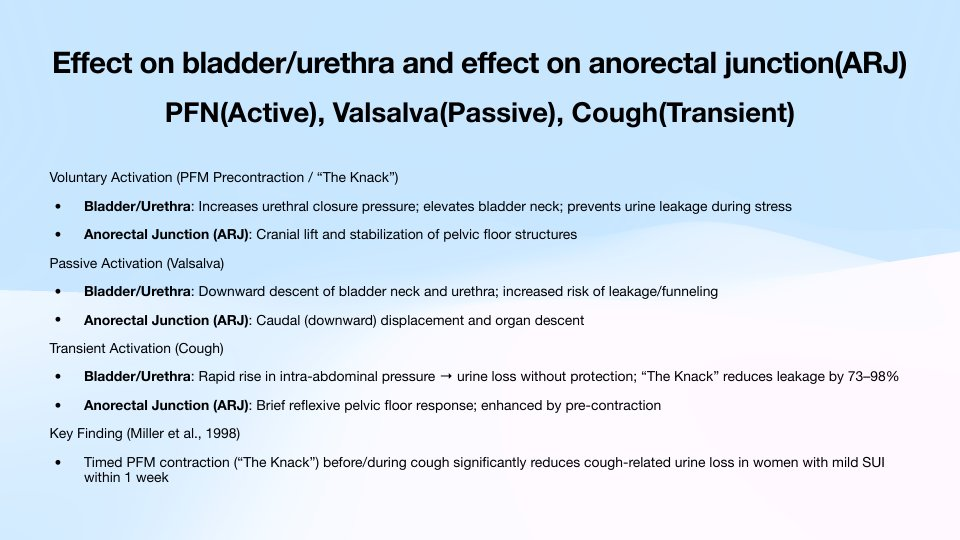
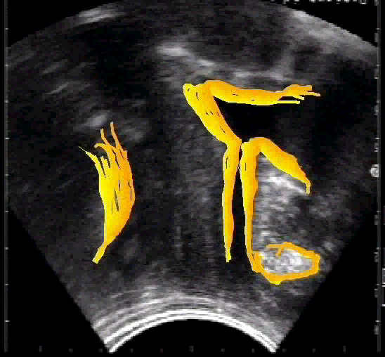
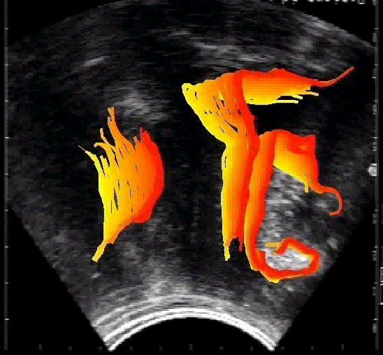
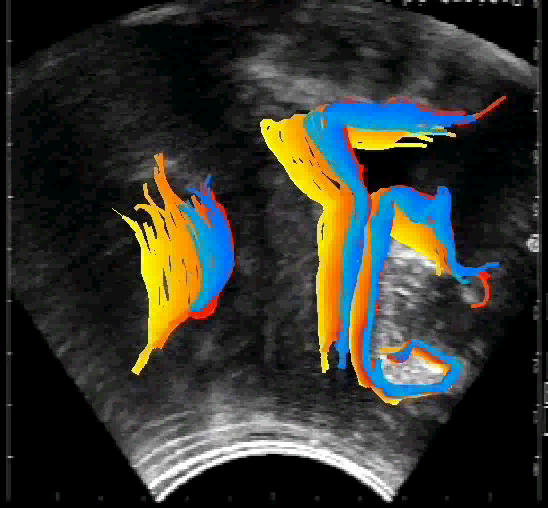

# 🔬 Phase 2 · Imaging Analysis & Research Presentation

**June 2026**

[⬅️ Back to project home](../README.md) · [⬅️ Phase 1](../01-phase-1-topic-and-data/)

---

## 🎯 Purpose

Turn imaging data and computational analysis into **interpretable findings, visual outputs, and a structured presentation**, guided by the mentor.

| 🧑‍🏫 Mentor's role | 🧑‍🎓 Student's role |
|---|---|
| Advises on clinically meaningful measurements, reviews preliminary figures, corrects interpretation, guides framing | Runs or refines the analysis workflow, organizes outputs, prepares figures, builds the presentation narrative |

## 🗓️ Planned session flow

## 📦 Deliverables

| Deliverable | Target | Status |
|---|---|---|
| 📓 **Image-analysis log** | Structured record of files reviewed, measurements, criteria and issues | 🟡 Started: [file inventory done](analysis-log.md), measurements to add |
| 🖼️ **Figure set** | A small group of clean, labeled figures | 🟡 In progress: [ultrasound stills for slides 5–7](media/ultrasound/frames/) ready |
| 🎤 **Research slides** | 8–12 slides: background, method, findings, limitations, next steps | ✅ Draft (12 slides, dated 6/22), being completed |

---

## 🎞️ Presentation

📥 **[Functional-Imaging-of-Pelvic-Floor-Muscles_slides_2026-06-22.pdf](presentation/Functional-Imaging-of-Pelvic-Floor-Muscles_slides_2026-06-22.pdf)**

| Slide | Content |
|:-:|---|
| 1 | Title: *Functional Imaging of Pelvic Floor Muscles: Ultrasound Scanning of Asymptomatic Subjects* |
| 2 | Methodology: purpose, probe, cohort, segments |
| 3 | Data collection and analysis: offline analysis, differentiating displacement to velocity to acceleration |
| 4 | Effects on bladder / urethra and on the anorectal junction |
| 5 – 7 | Perineal ultrasound evaluation: pelvic floor maneuver, Valsalva, cough *(image slots)* |
| 8 | Cough-induced displacement, velocity and acceleration |
| 9 | Function during voluntary, passive and transient activation |
| 10 | Interpretation of imaging |
| 11 | Take-home message |
| 12 | References *(to be completed)* |

<b>🖼️ Slide previews</b>

 

<table>
  <tr>
    <td></td>
    <td></td>
    <td></td>
  </tr>
  <tr>
    <td></td>
    <td></td>
    <td></td>
  </tr>
</table>

---

## 🎬 Media

MP4 (H.264) versions of the project clips, playable in any browser. Click a file in GitHub to watch it.

### 🩻 Annotated ultrasound (`media/ultrasound/`)

| File | Shows | Length |
|---|---|:-:|
| [`pfm-maneuver-knack.mp4`](media/ultrasound/pfm-maneuver-knack.mp4) | 💪 Voluntary pelvic floor maneuver | 6.4 s |
| [`valsalva.mp4`](media/ultrasound/valsalva.mp4) | ⬇️ Valsalva (passive) | 4.0 s |
| [`cough.mp4`](media/ultrasound/cough.mp4) | 💨 Cough (transient) | 2.7 s |

> [!TIP]
> These three clips line up with **slides 5 – 7**, one per test state. Ready-made stills for those slides are below.

### 🧪 Companion pressure visualizations (`media/pressure-maps/`)

Vaginal pressure (N/cm²) at superficial, middle and deep positions (anterior / posterior / left / right), plus angle-versus-depth pressure maps.

| File | Shows | Length |
|---|---|:-:|
| [`3d-normal-vs-SUI.mp4`](media/pressure-maps/3d-normal-vs-SUI.mp4) | 3D pressure view: normal subjects vs. SUI patients | 10.7 s |
| [`healthy-cough-vs-knack-maps.mp4`](media/pressure-maps/healthy-cough-vs-knack-maps.mp4) | Angle-vs-depth maps: cough vs. Knack, healthy subjects | 3.8 s |
| [`healthy-cough-profiles.mp4`](media/pressure-maps/healthy-cough-profiles.mp4) | Pressure profiles during cough, healthy subjects | 1.8 s |
| [`SUI-cough-profiles.mp4`](media/pressure-maps/SUI-cough-profiles.mp4) | Pressure profiles during cough, SUI patients | 1.8 s |
| [`SUI-knack-profiles.mp4`](media/pressure-maps/SUI-knack-profiles.mp4) | Pressure profiles during the Knack, SUI patients | 3.8 s |

<b>🔎 Original filenames (for traceability)</b>

 

| Renamed | Original file in the project folder |
|---|---|
| `ultrasound/pfm-maneuver-knack.mp4` | `pfm_without_cross Converted (Converted) 2.mov` |
| `ultrasound/valsalva.mp4` | `valsalva_without_cross Converted (Converted) 2.mov` |
| `ultrasound/cough.mp4` | `cough_without_cross Converted.avi` |
| `pressure-maps/3d-normal-vs-SUI.mp4` | `ThreeD_diff_normal_abnormal.avi` |
| `pressure-maps/healthy-cough-vs-knack-maps.mp4` | `TwoD_normal_cough_knack.avi` |
| `pressure-maps/healthy-cough-profiles.mp4` | `TwoD_normal_cough_Chris.avi` |
| `pressure-maps/SUI-cough-profiles.mp4` | `TwoD_SUI_cough_Chris 2.avi` |
| `pressure-maps/SUI-knack-profiles.mp4` | `TwoD_SUI_knack_Chris 2.avi` |

Byte-identical duplicates of these files were removed, and the originals were re-encoded from AVI/MOV to MP4 (same length and frame size).

### 🖼️ Ultrasound stills for slides 5 – 7 (`media/ultrasound/frames/`)

Three frames per test state, taken at roughly 20 %, 50 % and 80 % of each clip at full resolution (548 × 508 px). The traces build up over the movement, so the three frames show the motion unfolding. They are near-square, like the three image slots on each slide.

| Slide | Test state | Frames |
|:-:|---|---|
| 5 | 💪 Pelvic floor maneuver | [`1`](media/ultrasound/frames/slide-05_pelvic-floor-maneuver_1.png) · [`2`](media/ultrasound/frames/slide-05_pelvic-floor-maneuver_2.png) · [`3`](media/ultrasound/frames/slide-05_pelvic-floor-maneuver_3.png) |
| 6 | ⬇️ Valsalva | [`1`](media/ultrasound/frames/slide-06_valsalva_1.png) · [`2`](media/ultrasound/frames/slide-06_valsalva_2.png) · [`3`](media/ultrasound/frames/slide-06_valsalva_3.png) |
| 7 | 💨 Cough | [`1`](media/ultrasound/frames/slide-07_cough_1.png) · [`2`](media/ultrasound/frames/slide-07_cough_2.png) · [`3`](media/ultrasound/frames/slide-07_cough_3.png) |

<table>
  <tr>
    <td></td>
    <td></td>
    <td></td>
  </tr>
</table>

### 🫀 Anatomy animation (`media/anatomy-animation/`)

| File | Shows |
|---|---|
| [`pelvic_floor_2.mp4`](media/anatomy-animation/pelvic_floor_2.mp4) | 3D anatomy animation of the pelvic floor (carries a third-party PRIMAL logo). A second export of the same animation as Phase 1's `pelvic_floor (Converted).mov`, converted to MP4 so it plays in a browser. |

---

## 📚 Reading (`reading/`)

| File | About |
|---|---|
| [`Miller-1998_JAGS_pelvic-muscle-precontraction-The-Knack.pdf`](reading/Miller-1998_JAGS_pelvic-muscle-precontraction-The-Knack.pdf) | Miller, Ashton-Miller & DeLancey, *J Am Geriatr Soc* 1998. The study behind "The Knack", cited in the deck. |

Full citation and DOI: [`docs/references.md`](../docs/references.md).

---

## 📊 Findings so far

- 💪 **Voluntary contraction** compresses the urethra and gives it **greater support**.
- 💨 **Cough**: no significant caudal (downward) displacement.
- 🩻 Perineal ultrasound is a **non-invasive** way to image dynamic pelvic floor function and to derive numerical parameters.

*Preliminary. Not peer reviewed.*

## 🚀 Next steps

- [ ] 📓 Finish the image-analysis log
- [ ] 🖼️ Produce a clean, labeled figure set
- [ ] 🎞️ Drop the [ultrasound stills](media/ultrasound/frames/) into slides 5 – 7 and complete the References slide (text is ready in [`docs/references.md`](../docs/references.md))
- [ ] 🔎 Confirm the source of each figure (including the slide 8 graphs) and cite it

---

See also: [Project summary](../docs/project-summary.md) · [References](../docs/references.md) · [Data & privacy](../docs/data-and-privacy.md)
