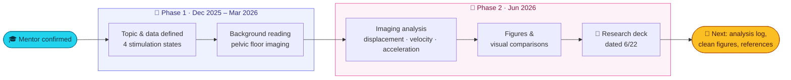
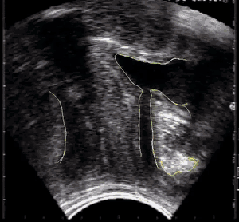
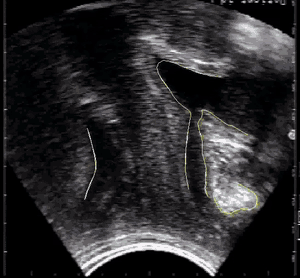
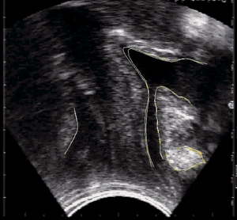
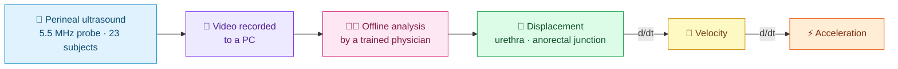
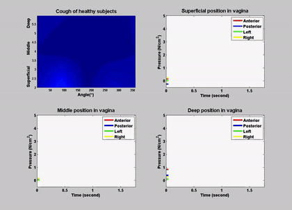
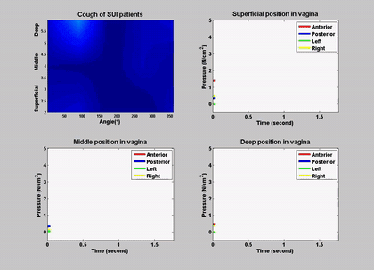
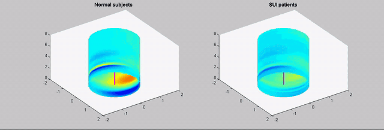

<div align="center">



<br>


**How does the pelvic floor move when we contract, push, and cough?**
A mentored biomedical-imaging project turning ultrasound recordings into displacement, velocity and acceleration.

[🎬 Watch the clips](#-see-it-in-action) ·
[🔬 Method](#-how-the-analysis-works) ·
[📊 Findings](#-preliminary-findings) ·
[🎤 Slides](#-the-research-deck) ·
[🚀 Roadmap](#-roadmap)

</div>

---

## 👋 At a glance

| | |
|---|---|
| 👤 **Author** | Aaryan Samanta |
| 🎓 **Mentor** | [Dr. Christos E. Constantinou](https://med.stanford.edu/profiles/christos-constantinou), Professor Emeritus, Stanford Surgery (Urology) & Human Biology |
| 🧬 **Focus** | Kinematic ultrasound imaging of the female pelvic floor |
| 🗓️ **Timeline** | Phase 1: Dec 2025 – Mar 2026 · Phase 2: Jun 2026 |
| 📌 **Status** | Preliminary findings · last updated 2026-09-19 |

> [!IMPORTANT]
> **Scope.** This repository documents the *analysis* of anonymized clinical ultrasound data **provided by the mentor**, plus a research presentation of preliminary findings. It is **not** a publication or a manuscript, and results are preliminary. Please read [Data & privacy](docs/data-and-privacy.md) before sharing.

---

## 🌈 The journey



---

## 🧭 Repository map

```text
stanford-urology-2026/
├── 📄 README.md                         ← you are here
├── 🎨 assets/                           banner + GIF previews used in READMEs
├── 📚 docs/
│   ├── project-summary.md               the whole project on one page
│   ├── references.md                    citations + reading list (DOIs)
│   └── data-and-privacy.md              data ownership, sharing & what is excluded
├── 🧭 01-phase-1-topic-and-data/        Dec 2025 – Mar 2026
│   ├── README.md                        topic, data description, goals
│   ├── reading/                         BJU 2002 (Constantinou et al.)
│   └── media/                           anatomy animation + annotated ultrasound clip
└── 🔬 02-phase-2-imaging-analysis/      Jun 2026
    ├── README.md                        sessions, deliverables, status
    ├── analysis-log.md                  image-analysis log (started)
    ├── presentation/                    research deck (PDF) + slide previews
    ├── reading/                         Miller 1998 ("The Knack")
    └── media/
        ├── ultrasound/                  3 annotated scans + frames/ (stills for slides 5–7)
        ├── pressure-maps/               5 companion pressure visualizations
        └── anatomy-animation/           3D anatomy animation (MP4)
```

| Go to… | What you'll find |
|---|---|
| [🧭 Phase 1](01-phase-1-topic-and-data/) | Why this topic, what the data are, the four stimulation states |
| [🔬 Phase 2](02-phase-2-imaging-analysis/) | The analysis workflow, deck, clips and deliverable status |
| [📚 Docs](docs/) | Summary, references and data-handling notes |

---

## 🎬 See it in action

Three test states, three scans. Colored traces follow the movement of the imaged structures.

<table>
  <tr>
    <td align="center"><b>💪 Voluntary<br>"The Knack"</b></td>
    <td align="center"><b>⬇️ Passive<br>Valsalva</b></td>
    <td align="center"><b>💨 Transient<br>Cough</b></td>
  </tr>
  <tr>
    <td></td>
    <td></td>
    <td></td>
  </tr>
  <tr>
    <td align="center"><sub>Contraction lifts and compresses</sub></td>
    <td align="center"><sub>Downward push tests support</sub></td>
    <td align="center"><sub>Rapid reflexive response</sub></td>
  </tr>
</table>

<sub>Full-quality MP4s: [`media/ultrasound/`](02-phase-2-imaging-analysis/media/ultrasound/)</sub>

---

## 🔬 How the analysis works



| | |
|---|---|
| **Cohort** | 23 asymptomatic subjects, age 31.1 ± 13.6 years |
| **Method** | Perineal ultrasound, 5.5 MHz elliptical probe |
| **Segments** | Urethral displacement · anorectal junction (ARJ) motility |
| **Velocity** | Differentiating displacement over time |
| **Acceleration** | Re-differentiating velocity over time |

### 🧩 The three test states

| State | 🩺 Bladder / urethra | 🍑 Anorectal junction |
|---|---|---|
| 💪 **Voluntary**<br>(PFM pre-contraction, "The Knack") | Raises urethral closure pressure, elevates the bladder neck, prevents leakage under stress | Cranial lift and stabilization of pelvic floor structures |
| ⬇️ **Passive**<br>(Valsalva) | Bladder neck and urethra descend; higher risk of leakage / funneling | Caudal (downward) displacement and organ descent |
| 💨 **Transient**<br>(Cough) | Sudden rise in abdominal pressure; leakage if unprotected | Brief reflexive response, enhanced by pre-contraction |

> [!TIP]
> **Why "The Knack" matters.** In a randomized study of 27 women with mild-to-moderate stress urinary incontinence, contracting the pelvic floor just before and during a cough cut leakage by an average of **98.2 %** (medium cough) and **73.3 %** (deep cough) within one week ([Miller et al., 1998](docs/references.md)).

---

## 📊 Preliminary findings

<table>
<tr>
<td width="50%" valign="top">

### 💪 Contraction supports the urethra
Voluntary pelvic floor muscle contraction results in **end compression of the urethra**, which gives the urethra **greater support**.

</td>
<td width="50%" valign="top">

### 💨 No significant downward shift on cough
There is **no significant caudal (downward) displacement** during a cough.

</td>
</tr>
</table>

> [!NOTE]
> **Take-home message.** Perineal ultrasound is a non-invasive way to image dynamic pelvic floor function, and image analysis turns it into numerical parameters for passive and dynamic activation.

### 🧪 Companion pressure visualizations

Vaginal pressure (N/cm²) at superficial, middle and deep positions, comparing healthy subjects and stress-incontinence (SUI) patients.

<table>
  <tr>
    <td align="center"><b>Cough · healthy</b></td>
    <td align="center"><b>Cough · SUI patients</b></td>
  </tr>
  <tr>
    <td></td>
    <td></td>
  </tr>
</table>

<p align="center">
  <br>
  <sub>3D pressure visualization · normal subjects vs. SUI patients</sub>
</p>

<sub>All five visualizations (MP4): [`media/pressure-maps/`](02-phase-2-imaging-analysis/media/pressure-maps/)</sub>

---

## 🎤 The research deck

*Functional Imaging of Pelvic Floor Muscles: Ultrasound Scanning of Asymptomatic Subjects* · draft dated 6/22 · 12 slides
**[📥 Open the full PDF](02-phase-2-imaging-analysis/presentation/Functional-Imaging-of-Pelvic-Floor-Muscles_slides_2026-06-22.pdf)**

<table>
  <tr>
    <td><a href="02-phase-2-imaging-analysis/presentation/"></a></td>
    <td><a href="02-phase-2-imaging-analysis/presentation/"></a></td>
    <td><a href="02-phase-2-imaging-analysis/presentation/"></a></td>
  </tr>
  <tr>
    <td><a href="02-phase-2-imaging-analysis/presentation/"></a></td>
    <td><a href="02-phase-2-imaging-analysis/presentation/"></a></td>
    <td><a href="02-phase-2-imaging-analysis/presentation/"></a></td>
  </tr>
</table>

---

## 🚀 Roadmap

- [x] 🎓 Mentor confirmed and topic defined *(Phase 1)*
- [x] 🎤 First research deck drafted with preliminary findings *(Phase 2, 6/22)*
- [ ] 📓 Finish the image-analysis log
- [ ] 🖼️ Produce a clean, labeled figure set
- [ ] 🎞️ Complete the deck: add the ultrasound frames and the References slide
- [ ] 🔎 Confirm the source of every figure and cite it
- [ ] 🧊 Confirm with the mentor whether the Phase 1 3D numerical model is still expected

---

## 📖 Mini-glossary

<details>
<summary><b>Click to expand</b></summary>

| Term | Meaning |
|---|---|
| **PFM** | Pelvic floor muscle |
| **SUI** | Stress urinary incontinence: leakage during effort such as coughing |
| **ARJ** | Anorectal junction |
| **The Knack** | A voluntary pelvic floor contraction timed just before and during a cough |
| **Valsalva** | Bearing down against a closed airway, which raises abdominal pressure |
| **Cranial / caudal** | Toward the head / toward the feet |
| **Kinematic imaging** | Imaging that captures *movement* (displacement, velocity, acceleration) rather than a still picture |

</details>

---

## 🔒 Data & ethics

> [!WARNING]
> The imaging data belong to **Dr. Constantinou**. This repository contains processed clips, visualizations and reading material: no subject records, names or identifiers. Two journal PDFs and a 3D anatomy animation are **third-party material**. **No license is granted**; all rights are reserved. Please obtain the mentor's permission before reusing or redistributing any media. Details: [`docs/data-and-privacy.md`](docs/data-and-privacy.md).

## 🙏 Acknowledgements

Sincere thanks to **Dr. Christos E. Constantinou** for the mentorship, the data, and the guidance on clinically meaningful measurement and interpretation.

<div align="center">

<sub>Made with 💜 for curious minds · Preliminary work, not peer reviewed</sub>

</div>
