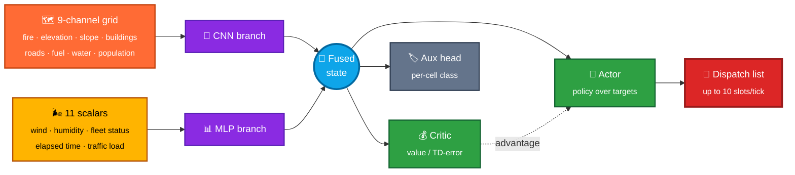
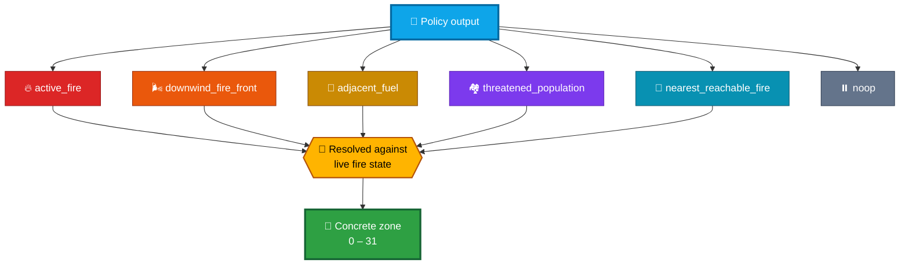

<div align="center">

# 🔥 InfernoTactics · InfernoCommand

### *A Fire-Relative Reinforcement Learning Framework for Multi-Resource Wildfire Response on a Real Los Angeles Terrain Model*

**UCLA COSMOS 2026 · Cluster 1**

<br>


<br>

*Amey Garg · Indraneel Adem · Leo Lin · Ayan D. Tuteja · Aaryan Samanta*

</div>

---

## 🧭 What this is

An agent that **dispatches firefighting resources against a spreading wildfire** on a real terrain
model of the Los Angeles Westside — Topanga State Park through Pacific Palisades, Brentwood and
Bel-Air, out to Westwood and UCLA — grounded in the **January 2025 Palisades Fire**.

> [!NOTE]
> The project goes by two names for the same thing: **InfernoTactics** in the code and modules,
> **InfernoCommand** on the poster.

<table>
<tr>
<td width="50%" valign="top">

**🗺️ Real data, not a toy grid**
- SRTM elevation + derived slope
- OSM buildings & road graph
- Population density raster
- NOAA ASOS wind/humidity (KSMO, Jan 7–8 2025)
- Real LAFD depot locations

</td>
<td width="50%" valign="top">

**🧠 Four course concepts, one agent**
- CNN over the spatial grid
- MLP over global scalars
- Auxiliary classification head
- Actor-critic reinforcement learning

</td>
</tr>
</table>

---

## 🏗️ Architecture



| | Concept | Role in the model |
|:--:|---|---|
| 🔲 | **CNN** | Spatial features from the grid — fire state, elevation, slope, buildings, roads, fuel, water, population |
| 📊 | **MLP** | Global scalars — wind speed/direction, humidity, per-type resource availability, elapsed time, traffic load |
| 🏷️ | **Classification** | Auxiliary head labelling every cell `Safe` / `Fuel` / `Threat` / `Blaze` |
| 🎮 | **RL (actor-critic)** | Chooses which resource goes where each tick; critic TD-error ties directly to the reward-prediction-error lecture |

---

## 💡 The key idea: a fire-relative action space

> [!IMPORTANT]
> The policy **never picks an absolute zone**. Each tick it chooses among *semantic* targets that
> resolve to wherever the fire currently is — which is exactly what lets it generalize to ignition
> points it never saw in training.



Full rationale, version history and results live in
**[`docs/PROJECT_CONTEXT.md`](docs/PROJECT_CONTEXT.md)**.

---

## 📈 Results

Run `relative_v10_multi_dispatch_100` — 100 episodes, CPU, synthetic traffic, 15 resources
(3 water teams · 4 trench crews · 3 rescue vehicles · 5 helicopters).

<div align="center">

| Training window | 🏆 Mean reward | 🏚️ Buildings lost | ✅ Contained |
|---|---:|---:|:---:|
| **Episodes 1 – 20** | `-27,980` | `95.2` | `14 / 20` |
| **Episodes 81 – 100** | `-13,381` | `44.1` | `16 / 20` |
| | 🟢 **52% better** | 🟢 **54% fewer** | 🟢 **+2** |

</div>

**Held-out evaluation** at checkpoint 20 vs. checkpoint 100 — the same three scenarios, same seed:

| Scenario | Checkpoint | Avg reward | Buildings lost | Containment |
|---|:--:|---:|---:|:--:|
| 🔴 `anchor` | ep 20 | `-144,521` | `483.5` | `0%` |
| 🟢 `anchor` | **ep 100** | **`-43,754`** | **`145.5`** | **`50%`** |
| 🔴 `mandeville_canyon` | ep 20 | `-18,239` | `69.5` | `0%` |
| 🟢 `mandeville_canyon` | **ep 100** | **`-11,688`** | **`44.5`** | **`50%`** |
| 🟢 `getty_view_park` | **ep 100** | **`-6.7`** | **`0.0`** | **`100%`** |

<div align="center">

📊 Dashboards: [`reports/<run_tag>/training_dashboard.png`](infernotactics/reports)

</div>

---

## 📁 Repository layout

```
🔥 ucla-cosmos-2026-c1-infernotactics/
│
├── 🧠 infernotactics/          Core RL package
│   ├── src/
│   │   ├── 🌐 data_pipeline/   fetch_* scripts + config.py (bbox, data paths)
│   │   ├── 🎮 env/             inferno_env.py · fire_sim.py · grid_builder.py · tests
│   │   ├── 🕸️  models/          relative_model.py (canonical) · CNN/MLP branches · actor_critic.py
│   │   ├── 🏋️  train/           train_relative.py · eval_relative.py · heuristic baseline · logging
│   │   └── ✅ validation/      Palisades perimeter validation (WFIGS)
│   ├── 💾 data/                weather CSV · grid metadata · simulation snapshots
│   ├── 🎯 models/              checkpoints, one folder per run tag
│   ├── 📜 logs/                per-run CSV/JSON logs · TensorBoard events
│   ├── 📊 reports/             training dashboards + summary.json per run
│   ├── 📓 notebooks/           v10_relative_actions.ipynb
│   └── 🔧 scripts/             ad-hoc check scripts (not part of the package)
│
├── 🌍 integration/             Live Cesium 3D demo (FastAPI backend + browser client)
├── 🎬 demo/                    Simulation3D.html — standalone replay viewer, no server
├── 📷 tools/                   camera_response_delay.py (ALERTCalifornia detection-delay prototype)
├── 📚 docs/                    poster · write-up · project context · tutorial · archived READMEs
└── 🗄️  archive/                superseded code, scratch files, old logs (kept, not maintained)
```

> [!WARNING]
> `integration/` and `infernotactics/` **must stay siblings**. The servers locate the model code and
> checkpoints via relative paths (`../infernotactics/...`).

---

## 🚀 Quick start

Everything runs from `infernotactics/`.

### 0️⃣ Environment

```bash
cd infernotactics
python -m venv .venv && source .venv/bin/activate        # or a conda env
pip install -r requirements.txt
pip install rich tensorboard                              # imported by the code, not yet in requirements.txt
export PYTHONPATH="$PWD/src"                              # PowerShell: $env:PYTHONPATH = "$PWD\src"
```

Tested on Python 3.11–3.14. **CPU PyTorch is enough** — the model is only ~250K parameters.

### 1️⃣ Rebuild the data

Large rasters are not committed; each script pulls from a public source.

```bash
python -m src.data_pipeline.fetch_elevation
python -m src.data_pipeline.fetch_population
python -m src.data_pipeline.fetch_buildings
python -m src.data_pipeline.fetch_roads
python -m src.env.grid_builder                            # -> data/grid_static.npy
```

### 2️⃣ Train, evaluate, test

```bash
# Train — defaults to 100 episodes with synthetic traffic
python -m src.train.train_relative

# Longer run with a custom tag
INFERNO_N_EPISODES=500 INFERNO_RUN_TAG=my_run python -m src.train.train_relative

# Evaluate a checkpoint on random ignition points
python -m src.train.eval_relative \
  --checkpoint models/checkpoints_relative_v10_multi_dispatch_100/latest.pt \
  --random-points 30 --episodes 1

# Render the dashboard -> reports/my_run/training_dashboard.png
python -m src.train.plot_training --run-tag my_run

# Tests
python -m unittest \
  src.env.test_multi_dispatch src.env.test_synthetic_traffic \
  src.env.test_inferno_env src.train.test_relative_actions
```

<details>
<summary><b>⚙️ Environment variables & schemas</b></summary>

<br>

More knobs — `INFERNO_MAX_DISPATCH_SLOTS`, `INFERNO_TRACE_EVERY`, and others — are documented in
[`docs/archive/README_v10_original.md`](docs/archive/README_v10_original.md), along with the full
observation schema, action interface, and resource roster.

**Study area** (WGS84): N `34.150` · S `34.030` · E `-118.440` · W `-118.605`
**Grid**: 595 × 316 cells @ 30 m, EPSG:5070
**Static layers**: elevation, slope, building_density, building_height, road_mask, fuel_density, water_mask, population_density — plus the live fire channel = **9 total**

</details>

### 3️⃣ Look at it

| | Demo | How |
|:--:|---|---|
| 🎬 | **Pre-rendered replay** | Open `demo/Simulation3D.html` in a browser. No server, no data needed. |
| 🌍 | **Live Cesium 3D** | Needs step 1 data + internet (Cesium tiles, camera feed). See below. |

```bash
# from the repository root
python -m uvicorn app:app --app-dir integration --host 127.0.0.1 --port 8000
```

Then open **<http://127.0.0.1:8000>**. It loads
`infernotactics/models/checkpoints_relative_v8/latest.pt`.

---

## 📚 Documents

| | Document | What's in it |
|:--:|---|---|
| 🖼️ | [`docs/poster/`](docs/poster) | Final poster — PDF + PowerPoint source |
| 📝 | [`docs/writeup/`](docs/writeup) | Wildfire Command outline: abstract, methods, reward function |
| 📖 | [`docs/PROJECT_CONTEXT.md`](docs/PROJECT_CONTEXT.md) | **Master record** — data sources, every model version, results, known limitations |
| 🎓 | [`docs/guides/TUTORIAL.md`](docs/guides/TUTORIAL.md) | Long-form walkthrough (paths are from the original Windows machine) |
| 🗺️ | [`docs/REORGANIZATION.md`](docs/REORGANIZATION.md) | Where every file moved, and what's missing from this repo |

---

## ⚠️ Honest caveats

> [!CAUTION]
> These are real limitations, not nitpicks. Read them before citing any number above.

| | Limitation |
|:--:|---|
| 🚗 | Traffic is **synthetic** — deterministic, road-class + BPR congestion — not real traffic data. |
| 🚁 | `HELICOPTER_RELOAD_TICKS = 12` is **unsourced** and strongly affects outcomes. |
| 🌲 | Fuel density is a **placeholder heuristic**, pending real LANDFIRE data. |
| 🛣️ | One of the 32 macro-zones is reachable **only by helicopter** — real road-graph asymmetry, not a bug. |

Full list: `docs/PROJECT_CONTEXT.md` **§11** (known limitations) and **§12** (not yet built).

---

<div align="center">

🔥 **Built at UCLA COSMOS 2026, Cluster 1** 🔥

<sub>Grounded in the January 2025 Palisades Fire · Data from SRTM, OpenStreetMap, NOAA ASOS, WFIGS</sub>

</div>
